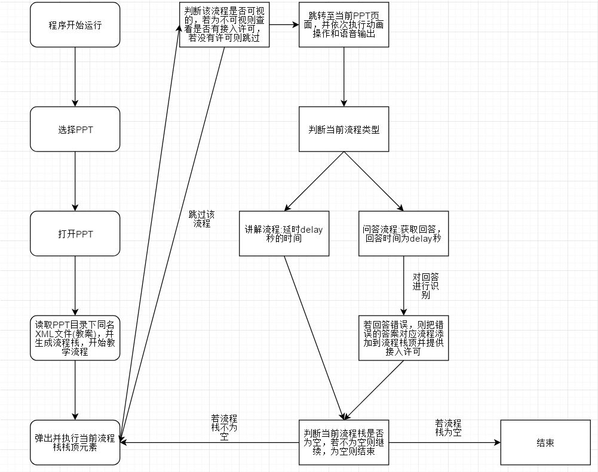
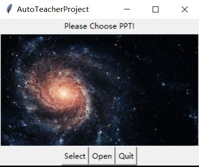
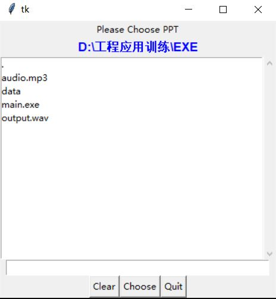

# AutoTeacherProject

## 功能介绍

- 1.可以自由读取PPT和教案，进行自动的教学流程
- 2.XML文件(教案)制作可以使用按照格式的txt文档转换而成
- 3.支持问题流程，若问题存在多个答案，可以对问题的答案进行分别识别和处理
- - 可以针对回答的漏洞，回溯特定的环节
- 4.支持隐藏层，若不被问题流程激活则不进入教学流程
- - 可以设置教案的visual元素0定义隐藏层，该特殊的流程来应对问题流程，只有在被问题流程激活后，才可以进入教学流程
- 5.问题答案支持模糊搜索
- - 教案的exact元素若为0则搜索非精确解，使用近义词模块生成答案的近义词，若与生成的词匹配，则回答正确

## 使用方法

- 1.运行EXE文件，保证data文件夹和EXE文件在同一目录
- 2.点击Select后在子窗口选择PPT，保证PPT与同名XML文件(教案)在同一目录下
- 3.在子窗口点击Choose选择PPT
- 4.主窗口显示Already Open XXXXXX.PPT
- 5.点击Open，开始运行主流程
- 6.主流程结束后，可以选择Quit退出，也可以重复进行以上操作

## 程序运行流程图




## 教学流程设计模块

- 提供教案到XML规范化流程的映射

- 文本(+PPT) -> XML
- - 对非必要元素提供默认填充

- 即时(顺序)输入

- - 输入过程与教学流程顺序有关

XML输入格式如下：
```
<root>
    <workflow>
        <workflow0>
            <index>顺序<index/>
            <visual>1(是否可视1 or 0)<visual/>
            <type>1(讲解类型)<type/>
            <word>该说的语音<word/>
            <delay>等待的时间<delay/>
            <click>动画效果点击次数(num),点击操作在语音输出之前进行<click/>
            <index_PPT>PPT的页码<index_PPT/>
        <workflow0/>
        <workflow1>
            <index>顺序<index/>
            <visual>1(是否可视1 or 0)<visual/>
            <type>2(问答类型)<type/>
            <word>该说的语音<word/>
            <delay>等待的时间<delay/>
            <click>动画效果点击次数(num),点击操作在语音输出之前进行<click/>
            <index_PPT>PPT的页码<index_PPT/>
            <result>
                <word1>
                    <txt>问题的答案（文本）<txt/>
                    <exact>1/0(是否为精确解)<exact/>
                    <workflow_index>问题出现的流程index<workflow_index/>
                <word1/>
            ......
            <result/>
        <workflow1/>
        ......
    <workflow/>
<root/>
```

## 流程读取模块

- 将xml流程读取，并生成流程栈

- 流程栈的顺序默认以index元素大小控制

- xml -> [dict...]

- 流程栈元素格式:
```
{'index': str, 'visual': str, 'type': '1', 'word': str, 'delay': str, 'click': str, 'index_PPT': str}
or
{'index': str, 'visual': str, 'type': '2', 'word': str, 'delay': str, 'click': str, 'index_PPT': str, 'result': [{'txt': str, 'exact': str, 'workflow_index': str}]}
```

## 主流程控制模块

主流程运行顺序:

- 0.初始化生成，读取PPT和教案文件并生成流程栈
- 1.从流程栈里读取一个流程
- 2.识别当前流程是否为可视的(visual)，若不可视，则查看是否有查看许可，若没有许可，则跳过该流程
- 3.跳转至当前PPT位置
- 4.执行动画效果触发
- 5.执行语音输出
- 6.执行讲解或者问题流程特定的内容
- 7.识别当前流程类型
- - 8.讲解流程:
- - 延时workflow['delay']属性\(单位秒\)的时间
- - 9.问答流程:
- - 获取问题回答，作答时间为声音发出后的workflow['delay']\(单位秒\)的时间
- - 如果出现问题回答错误，则将该问题所属流程序号插入流程栈栈顶(若所属流程号为空则不进行操作)
- 10.重复以上流程，直到流程栈为空
- 11.结束，退出PPT

## 语音识别模块

- 使用百度开放平台的API，以在线调用的方式进行语音转文字和文字转语音

## 动作执行模块

- 调用pykeyboard实现键盘操作，控制PPT的播放、向前翻页、向后翻页、结束放映
- 采用获取电脑屏幕尺寸并点击屏幕正中央的方式实现PPT中播放和暂停动画的功能
- 注意实验电脑需要关闭自带功能键（才能用快捷键F5播放PPT）


## 教案制作模块

- txt转xml:

txt:
```
1|1|你好，单车的近义词有脚踏车||0|1
```
xml:
```
<?xml version="1.0"?>
-<root>
    -<workflow>
        -<workflow0>
            <index>0</index>
            <visual>1</visual>
            <type>1</type>
            <word>你好，单车的近义词有脚踏车</word>
            <delay>0</delay>
            <click>0</click>
            <index_PPT>1</index_PPT>
        </workflow0>
    </workflow>
</root>
```
其中，txt输入以|作为分隔符，且部分空输入有自动推测和填充的功能。

## 近义词模块

- 近义词模块可以生成近义词
- 例:
```
from SimilarWordUtils.similar_word_utils import SimilarWordUtils

similar_tools = SimilarWordUtils()
print(similar_tools.getSimilarWord("我"))
print(similar_tools.getSimilarWord("你"))
print(similar_tools.getSimilarWord("他"))
print(similar_tools.getSimilarWord("自行车"))
```
output:
```
['自己', '自家', '自个儿', '自各儿', '自身', '本身', '自我', '本人', '小我', '我', '自', '己']
['你', '您', '恁', '而', '尔', '汝', '若', '乃', '卿', '君', '公']
['异', '他', '外', '客']
['自行车', '脚踏车', '单车', '车子']
```

- 使用算法基于哈工大词林，使用顺序编号映射词林给出的每一组近义词，并对每一个词用hash编码存储并将其映射到其属于的近义词组的编号上。在我们查找近义词时，首先生成其hash码，并查找到它所属的近义词组编号，最后输出近义词组。

## GUI设计

- 主界面



- 子界面


